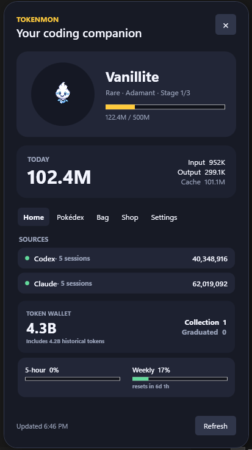
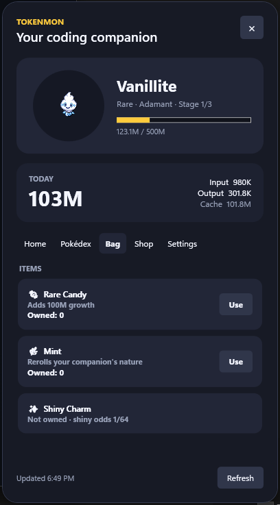

# Tokenmon

Turn the tokens used by your local AI coding tools into a Pokémon-style desktop companion for Windows.

Tokenmon lives in the notification area, reads local usage logs, and converts token activity into progress for an evolving companion. Keep coding to hatch eggs, evolve Pokémon, grow your collection, and earn currency for in-app items.

> [!NOTE]
> Tokenmon is an unofficial, non-commercial fan project. Pokémon names, characters, and artwork belong to their respective owners.

## Screenshots

| Home | Bag |
| --- | --- |
|  |  |

## Features

- Native Windows notification-area icon and context menu
- Polished WPF flyout with today's token usage
- Transparent, draggable floating desktop companion
- Local usage readers for Codex, Claude Code, and Gemini CLI JSONL data
- Codex five-hour and weekly utilization from the local app-server account snapshot
- Capture-rate-weighted egg hatching and evolution-line progression backed by [PokéAPI](https://pokeapi.co/)
- Cached Generation V sprites for offline companion display
- Common, Uncommon, Rare, Legendary, shiny, and 25-nature variants
- Final-form graduation, automatic new eggs, a Pokédex, and a catch log
- Token wallet, Bag, Rare Candy, Mints, Shiny Charm, and three shop egg tiers
- Tray notifications for hatches, evolution, and graduation
- Optional launch at sign-in

## Requirements

- Windows 10 or later
- [.NET 10 SDK](https://dotnet.microsoft.com/download/dotnet/10.0) when building from source
- At least one supported local coding tool with usage data: Codex, Claude Code, or Gemini CLI

## Run from source

Clone the repository, then run:

```powershell
dotnet run --project Tokenmon.App
```

Tokenmon opens its flyout and adds a Poké Ball to the notification area. Left-click the icon to reopen the flyout, or right-click it for refresh, companion visibility, and exit actions. Launch-at-login starts quietly in the tray.

Tokens grow the current companion and also accumulate as shop currency. Spending currency does not remove growth progress.

## Privacy

Usage is calculated locally from supported tools' files under your Windows user profile. Tokenmon does not upload prompts, project paths, or token data.

Companion state, settings, cached sprites, and error logs are stored under `%LOCALAPPDATA%\Tokenmon`. Pokémon species information and sprites are fetched from PokéAPI and the [PokéAPI sprite repository](https://github.com/PokeAPI/sprites) as needed.

## Development

Restore and test the solution:

```powershell
dotnet restore Tokenmon.slnx
dotnet test Tokenmon.slnx
```

Create a self-contained Windows x64 build:

```powershell
dotnet publish Tokenmon.App -c Release -r win-x64 --self-contained true -p:PublishSingleFile=true
```

Published output is generated beneath `Tokenmon.App/bin/Release/` and is intentionally excluded from source control.

## Project structure

| Project | Purpose |
| --- | --- |
| `Tokenmon.App` | WPF user interface, tray integration, startup behavior, and desktop companion |
| `Tokenmon.Core` | Usage parsing, persistence, PokéAPI integration, and game rules |
| `Tokenmon.Core.Tests` | xUnit tests for parsers, rate limits, and companion progression |

## Contributing

Bug reports and pull requests are welcome. See [CONTRIBUTING.md](CONTRIBUTING.md) for the local development workflow.

## License

The source code is available under the [MIT License](LICENSE). This license does not grant rights to Pokémon names, characters, artwork, or other third-party assets.
